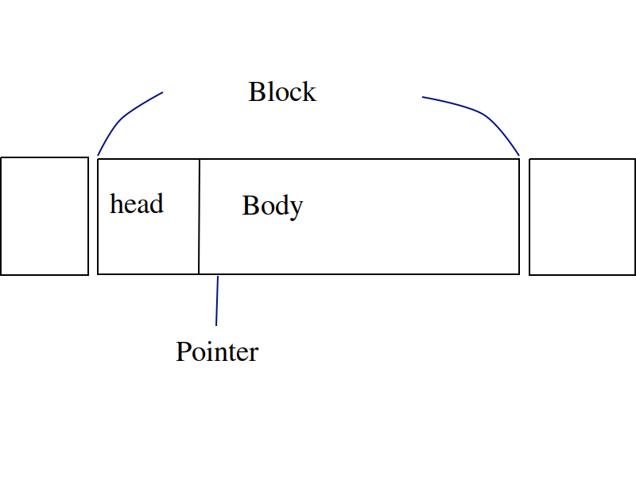

# 初めに
WebAssemblyには線形メモリがあるだけで動的なメモリ管理機能はありません。
ライブラリを使うことも出来ますが、今回はmallocとfreeを実際に実装してみます。

# 方針
* パフォーマンスは気にしない。とにかく動くものを作る
* wasmのテキストフォーマットであるwatで実装する

# 仕様
mallocを呼び出すとメモリブロックが作られます。
メモリブロックにはヘッダ部とボディ部があり、mallocはボディ部の先頭アドレスを返します。
このボディ部の先頭アドレスをブロックのポインタとします。




メモリアドレスは0から始まり、ボディの前にヘッダが入ることからブロックのポインタが0になることはないことがわかるかと思います。
ブロックの間には隙間がなく、またmallocは要求サイズ以上確保するのではなくぴったり要求サイズ確保するものとします。

ヘッダのメモリ配置

|サイズ|名前|説明|
|:--|:--|:--|
|1|flag|終端ブロック:0、未使用:1、使用中:2|
|4|size|ボディのサイズ|
|4|prev|前ブロックのポインタ。先頭ブロックなら0|

終端ブロックはここから先ブロックが存在しない事を表すブロックです。また終端ブロックのsizeやprevは未定義です。bodyもありません。

# 実装

## 定数宣言

マジックナンバーを減らすためいくつかの定数を宣言します。
`HEAD_SIZE`はヘッダのサイズ、`USE_FLAG_***`はflagの列挙値です。

```
(global $HEAD_SIZE (export "HEAD_SIZE") i32 (i32.const 9))
(global $USE_FLAG_INVALID (export "USE_FLAG_INVALID") i32 (i32.const 0))
(global $USE_FLAG_NON_USE (export "USE_FLAG_NON_USE") i32 (i32.const 1))
(global $USE_FLAG_USE (export "USE_FLAG_USE") i32 (i32.const 2))
```

## util関数の宣言

```
(func $get_flag_p (param $p i32) (result i32)
  (i32.sub (get_local $p) (i32.const 9))
)

(func $get_flag (export "get_flag") (param $p i32) (result i32)
  (i32.load8_u (call $get_flag_p (get_local $p)))
)

(func $set_flag (param $p i32) (param $v i32)
  (i32.store8 (call $get_flag_p (get_local $p)) (get_local $v))
)
```

`get_flag_p`はブロックのポインタを渡すとそのブロックのフラグ値が格納されている先頭アドレスを返します。
これはブロックのポインタから9を引いた値です。
また`get_flag`と`set_flag`はブロックのポインタを渡すとフラグ値を返します。フラグは1byteなので`i32.load8_u`/`i32.store8`を使っています。

次に`size`と`prev`に関しても同じように実装します。

```
(func $get_size_p (param $p i32) (result i32)
  (i32.sub (get_local $p) (i32.const 8))
)

(func $get_size (export "get_size") (param $p i32) (result i32)
  (i32.load (call $get_size_p (get_local $p)))
)

(func $set_size (param $p i32) (param $v i32)
  (i32.store (call $get_size_p (get_local $p)) (get_local $v))
)

(func $get_prev_p (param $p i32) (result i32)
  (i32.sub (get_local $p) (i32.const 4))
)

(func $get_prev (export "get_prev") (param $p i32) (result i32)
  (i32.load (call $get_prev_p (get_local $p)))
)

(func $set_prev (param $p i32) (param $v i32)
  (i32.store (call $get_prev_p (get_local $p)) (get_local $v))
)
```

次にブロックの`flag`/`size`/`prev`をまとめてセット出来る関数も作ります。

```
(func $set_block (param $p i32) (param $flag i32) (param $size i32) (param $prev i32)
  (call $set_flag (get_local $p) (get_local $flag))
  (call $set_size (get_local $p) (get_local $size))
  (call $set_prev (get_local $p) (get_local $prev))
)
```

これはブロックのポインタを渡すと次のブロックのポインタを返す関数です。
次のブロックのポインタは`現在のブロックのポインタ+現在のブロックのbodyサイズ+ヘッダのサイズ`なので次のようになります。

```
(func $get_next (export "get_next") (param $p i32) (result i32)
  (i32.add (i32.add (get_local $p) (call $get_size (get_local $p))) (get_global $HEAD_SIZE))
)
```

## malloc
mallocの仕様を説明します。
ここから使用中のブロックを`[bodyサイズ]`、未使用のブロックを`(bodyサイズ)`と表現します。

`[3][4]`の時`malloc(3)`するとどこに確保すればいいでしょうか？これは当然一番最後ですね。よって`[3][4][3]`となります。
では`[3](4)[2]`の時`malloc(4)`するとどこに確保すればいいでしょうか？最後に追加することも出来ますが途中に未使用のブロックが途中にあるのでここに挿入します。よって`[3][4][3]`となります。
次に`[3](4)[2]`の時`malloc(5)`を考えます。この時途中に空きがありますが明らかに足りません。よって最後に追加し`[3](4)[2][5]`となります。
次に`[3](4)[2]`の時`malloc(3)`はどうでしょう？実はこれ、途中に追加することが出来ません。なぜかというとこの時`(4)`を２つのブロックに分ける必要がありますが、ヘッダサイズは9です。つまり２つのブロックに分けたくても出来ないのです。よって最後に追加し`[3](4)[2][3]`とします。
`[3](16)[2]`の時`malloc(3)`であれば２つのブロックに分割出来ます。この時1つブロックが増える→ヘッダが1つ増える→使える部分が9バイト減るので`[3][3](4)[2]`となります。

これらをまとめると次のような擬似コードになります。
ブロックの分割は周辺ブロックのprevの修正が必要な事に注意して下さい。

```
HEAD_SIZE=9

func malloc(size){
  for(block in block_list){
    if(!block.is_use){
      if(block.size==size){
        block.is_use=true;
        return block;
      }else if(block.size+HEAD_SIZE>=size){
        [result,_]=block.split([size,block.size-size-HEAD_SIZE]);
        return result;
      }
    }
  }
  return block_list.append(size);
}
```

これをプログラムにすると以下のようになります。


```
(func $malloc (export "malloc") (param $size i32) (result i32)
  (local $i i32)
  (local $prev i32)
  (local $old_size i32)

  (set_local $i (get_global $HEAD_SIZE))

  ;;無効でなければループ
  loop $loop
    (if (i32.ne (call $get_flag (get_local $i)) (get_global $USE_FLAG_INVALID))
      (then
        ;;未使用
        (if (i32.eq (call $get_flag (get_local $i)) (get_global $USE_FLAG_NON_USE))
          (then
            ;;サイズと等しい
            (if (i32.eq (call $get_size (get_local $i)) (get_local $size))
              (then
                ;;未使用→使用中
                (call $set_flag (get_local $i) (get_global $USE_FLAG_USE))
                (return (get_local $i))
              )
            )

            ;;要求サイズ+ヘッダサイズ以上
            (set_local $old_size (call $get_size (get_local $i)))
            (if (i32.ge_s (get_local $old_size) (i32.add (get_local $size) (get_global $HEAD_SIZE)))
              (then
                ;;==使用部分==
                (call $set_block (get_local $i) (get_global $USE_FLAG_USE) (get_local $size) (get_local $prev))
                
                ;;==余り==
                (call $set_block (call $get_next (get_local $i)) (get_global $USE_FLAG_NON_USE) (i32.sub (get_local $old_size) (i32.add (get_local $size) (get_global $HEAD_SIZE))) (get_local $i))
                
                ;;==次==
                (call $set_prev (call $get_next (call $get_next (get_local $i))) (call $get_next (get_local $i)))

                (return (get_local $i))
              )
            )
          )
        )
        (set_local $prev (get_local $i))
        (set_local $i (call $get_next (get_local $i)))
        br $loop
      )
    )
  end

  ;;ラストに追加し、次のブロックを無効にする
  (call $set_block (get_local $i) (get_global $USE_FLAG_USE) (get_local $size) (get_local $prev))
  (call $set_flag (call $get_next (get_local $i)) (get_global $USE_FLAG_INVALID))

  (return (get_local $i))
)
```

# free
free、flagを未使用に変えるだけでも実装出来ます。
ですが例えば`[3][2](5)[3]`の時2番目のブロックを解放する場合どうするべきでしょうか？
単純実装だと`[3](2)(5)[3]`となります。しかし連続する未使用のブロックは断片化を防ぐため結合するべきです。
よって`[3](16)[3]`となります。18byte増えたのは2つのブロックの結合によってヘッダが1ブロック分不要になったからです。
また`[2][3]`の最後のブロックを解放する場合、ブロックの存在ごと消して`[2]`とします。
結合処理を組み合わせると`[2](3)[2]`で最後のブロックを解放する場合、2番目のブロックも消して`[2]`となります。
毎回結合処理を行っていれば未使用ブロックが2つ続くことはないので前後のブロックだけ確認すればいいことも分かるかと思います。

まず２つのブロックを結合する関数です。
`join_prev`は後ろのブロックと、`join_next`は次のブロックと結合します。
周辺ブロックの`prev`の書き換えも忘れずに行わなければいけません。

```
(func $join_prev (param $p i32) (result i32)
  (local $size i32)
  (local $prev i32)
  (local $next i32)

  (set_local $prev (call $get_prev (get_local $p)))
  (set_local $next (call $get_next (get_local $p)))
  (set_local $size (i32.add (call $get_size (call $get_prev (get_local $p))) (i32.add (call $get_size (get_local $p)) (get_global $HEAD_SIZE))))

  (call $set_size (get_local $prev) (get_local $size))
  (if (i32.ne (call $get_flag (get_local $next)) (get_global $USE_FLAG_INVALID))
    (then
      (call $set_prev (get_local $next) (get_local $prev))
    )
  )

  (get_local $prev)
)

(func $join_next (param $p i32)
  (local $size i32)
  (local $next_next i32)

  (set_local $size (i32.add (call $get_size (call $get_next (get_local $p))) (i32.add (call $get_size (get_local $p)) (get_global $HEAD_SIZE))))
  (set_local $next_next (call $get_next (call $get_next (get_local $p))))

  (call $set_size (get_local $p) (get_local $size))
  (if (i32.ne (call $get_flag (get_local $next_next)) (get_global $USE_FLAG_INVALID))
    (then
      (call $set_prev (get_local $next_next) (get_local $p))
    )
  )
)
```

これらを使うとfreeは以下のようになります。

```
(func $free (export "free") (param $p i32)
  ;;先頭ポインタでないかつ前が空いているならjoin
  (if (i32.ne (get_local $p) (get_global $HEAD_SIZE))
    (then
      (if (i32.eq (call $get_flag (call $get_prev (get_local $p))) (get_global $USE_FLAG_NON_USE))
        (then
          (set_local $p (call $join_prev (get_local $p)))
        )
      )
    )
  )

  ;;後ろが空いているならjoin
  (if (i32.eq (call $get_flag (call $get_next (get_local $p))) (get_global $USE_FLAG_NON_USE))
    (then
      (call $join_next (get_local $p))
    )
  )

  (if (i32.eq (call $get_flag (call $get_next (get_local $p))) (get_global $USE_FLAG_INVALID))
    ;;次が無効
    (then
      (call $set_flag (get_local $p) (get_global $USE_FLAG_INVALID))
    )
    (else
      (call $set_flag (get_local $p) (get_global $USE_FLAG_NON_USE))
    )
  )
)
```

おわり
